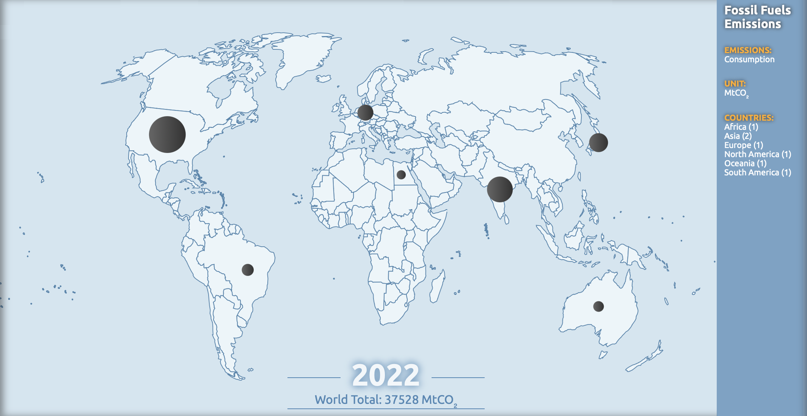

This data story is an exploration of the UN's Sustainable Development Goals 7 (affordable and clean energy), 12 (responsible consumption and production), and 13 (climate action). I was looking at how energy consumption and contributions to carbon emissions differ among countries with different GDP's, using data from the [Global Carbon Project](https://www.globalcarbonproject.org/carbonbudget/). The countries that I focused on where the United States, Germany, Egypt, India, Brazil, Australia, and Japan. From this exploration, I found the imbalance between the largest contributors to climate change and where the consequences of consumption are felt the most.

Link to my [data story](https://hannahbarrow.github.io/energy/).

Link to GitHub [repo](https://github.com/hannahbarrow/energy).

