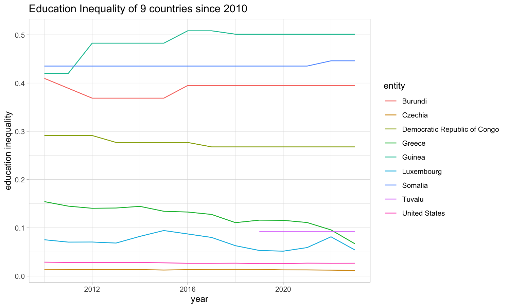

This data story is an exploration of the UN's Sustainable Development Goals 4 (quality education) and 5 (gender equality). Using data from [Our World In Data](https://ourworldindata.org), I explored how countries of varying GDP's also differ in their spending on education, education inequality, and enrollment. I highlighted the imbalanced relationship between a countries GDP and how much of that money is actually going towards education citizens and that it is often the countries with lower wealth that are putting more of their money towards education.

Link to my [data story](https://hannahbarrow.github.io/education/).

Link to GitHub [repo](https://github.com/hannahbarrow/education).

