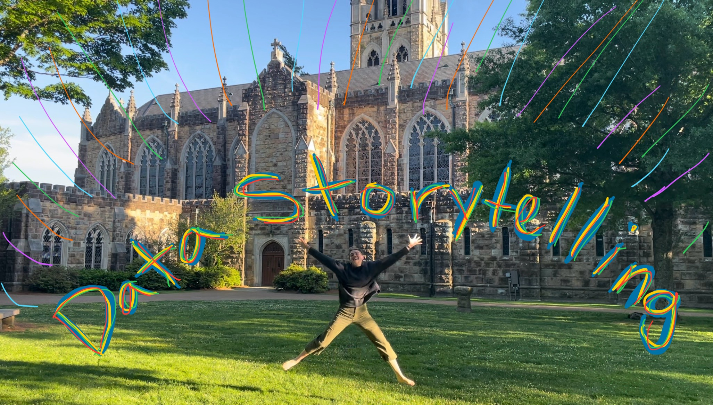

There are a few data stories that I didn't get to do this semester that I would 
have really liked to (3 and 6). But... maybe I'm actually a genius because now 
that I'm graduating/finishing this class, I will be able to stay sharp with my R 
skills because now I can have more projects to work on! I'm not joking, I will 
probably do data story 6 this summer because it's fun and I did really want to 
get to explore [data on SDG 12](https://ourworldindata.org/sdgs/responsible-consumption-production). 

