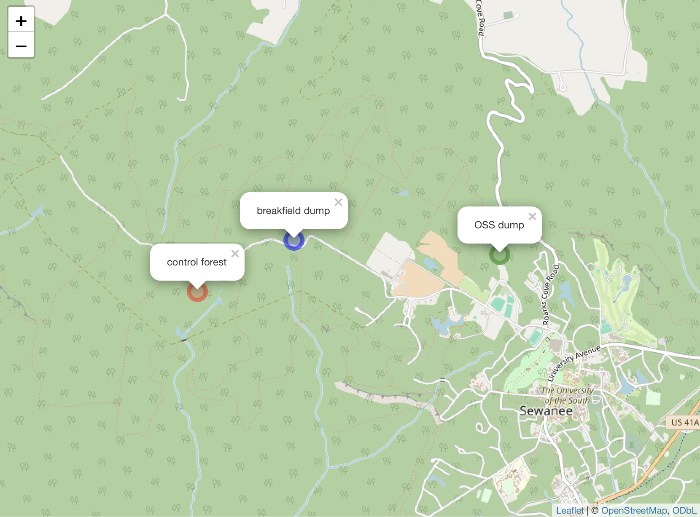

For this data story, I created a data collection app for Beatrix to use while collecting data on tree composition at various sites for her independent study work. She was comparing the forest composition at different sites with various archaeological sites to see if the presence of structures alters the compositions that you will fin. Specifically, I was given data from two dump sites that she visited.

Link to my [data story](https://hannahbarrow.github.io/tree-data-collection/).

Link to GitHub [repo](https://github.com/hannahbarrow/tree-data-collection) + the [code](https://github.com/hannahbarrow/tree-data-collection/blob/main/docs/data_collection_app.R) for my app.

