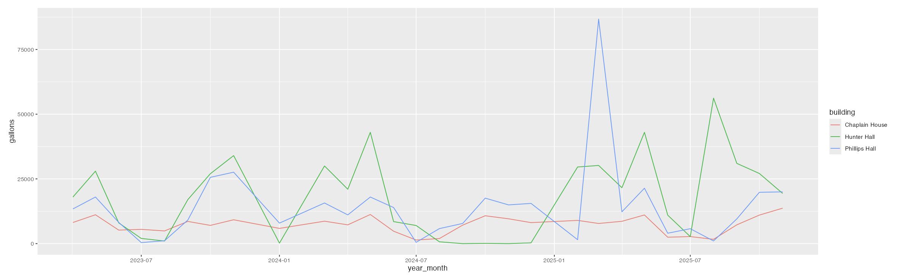

This data story is relevant to UN's Sustainable Development Goals 6 (clean water and sanitation) and 12 (responsible production and consumption). For this data story, I was exploring data collected in Sewanee on utility use, specifically water use. I explored the different buildings on campus to compare their use and the cost of water in each building. I would like to improve this data story by adding more information on the buildings and occupancy to make better comparisons. 

Link to GitHub [repo](https://github.com/hannahbarrow/utilities/tree/main).

